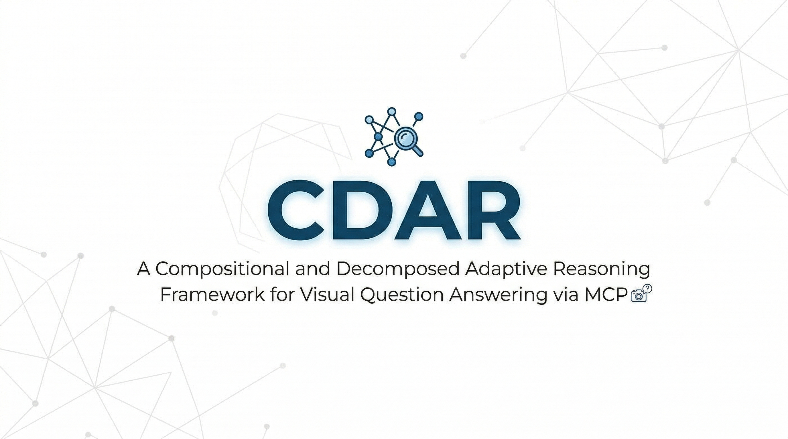

<p align="center">
  
</p>

# CDAR Open-Source Package

**CDAR** (A Compositional and Decomposed Adaptive Reasoning Framework for Visual Question Answering via MCP) is an open-source tool designed to enhance Visual Question Answering (VQA) through dynamic reasoning strategies using the Model Context Protocol (MCP).

This repository contains the documentation and implementation for the CDAR framework, aligned with `cdar/cdar_mcp.py` and configuration files in `cdar/prompts_upgrade/`.

---

## 📂 Repository Structure

The current package includes the following files:

- **`README.md`**: Package overview (this file).
- **`SETUP.md`**: Installation and environment setup instructions.
- **`RUN_EXAMPLE.md`**: Server start guides and strategy usage examples.
- **`REPRODUCIBILITY.md`**: Reproducibility checklist based on current default configurations.
- **`.env.example`**: Template for optional environment variables currently supported by the code.
- **`.gitignore`**: Standard Git ignore rules.
- **`LICENSE`**: MIT license template.

---

## ⚙️ Implementation Details & Features

Based on the current implementation in `cdar/cdar_mcp.py`, please note the following key technical details:

- **MCP Entrypoint**: The server is executed via `python cdar/cdar_mcp.py` (which triggers `mcp.run()` in `__main__`).
- **Exposed MCP Tool**: The primary tool exposed is `cdar_compositional_decomposed_adaptive_reasoning(...)`.
- **Reasoning Strategies (`force_strategy`)**:
  - `direct`: Forces a direct answering approach.
  - `decomposed`: Forces a step-by-step decomposed reasoning approach.
  - *Unset (Default)*: The system uses an **adaptive** strategy, automatically choosing the best approach based on the input.
- **Prompts & Configs**: The directory for loading prompts and configurations is rigidly set to `cdar/prompts_upgrade/`.
- **Environment Variables**:
  - `SILICONFLOW_MODEL`: Supports environment override via `.env` or system variables.
  - ⚠️ **Important Note**: `SILICONFLOW_API_KEY` is currently **hardcoded** directly within `cdar_mcp.py` and is *not* loaded from the `.env` file in the current code version. Please update the source code directly with your API key before running.

---

## 🚀 Quick Start

To get started with CDAR, please follow these steps in order:

1. **Setup**: Review `SETUP.md` for installation and dependency requirements.
2. **Configuration**: Edit `cdar/cdar_mcp.py` to insert your `SILICONFLOW_API_KEY`. Check `.env.example` for other configurable variables.
3. **Run**: Start the MCP server by running:
   ```bash
   python cdar/cdar_mcp.py
