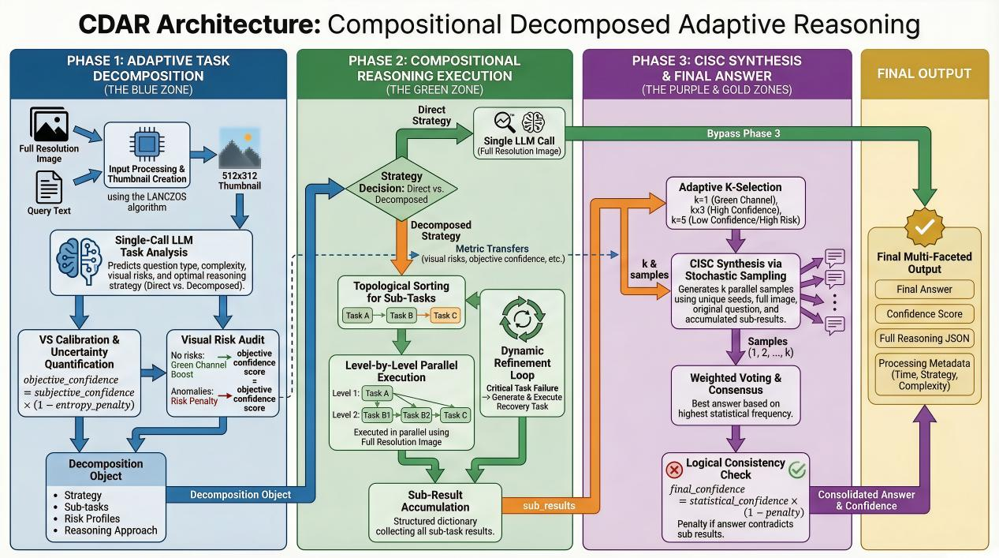

<p align="center">
  
</p>

# 🧠 CDAR

**CDAR** (Compositional Decomposed Adaptive Reasoning) is an MCP server for Visual Question Answering, built on [FastMCP](https://github.com/jlowin/fastmcp). It takes a local image file and a natural-language question, then returns a structured JSON answer with multi-stage confidence scoring.

> MCP server name: `"CDAR: Compositional Decomposed Adaptive Reasoning"`

---

## ⚙️ Pipeline Overview



The system executes three sequential phases:

### Phase 1 — 🔍 Adaptive Task Decomposition

Function: `adaptive_task_decomposition()`

- Sends the question + a **thumbnail** of the image to the model for initial analysis.
- Parses the model output into a `Decomposition` dataclass containing: `question_type`, `complexity`, `strategy`, `reasoning_approach`, `sub_tasks`, `composition_plan`, `confidence`, `objective_confidence`, `path_distribution`, `confidence_rationales`, `visual_risks`, `sub_types`.
- **VS Calibration**: computes an objective confidence score via `calibrate_phase1_confidence()`, using question-type-specific weights from `question_types.json`.
- If objective confidence falls below `objective_confidence_threshold`, forces strategy to `decomposed`.
- **Visual Risk Assessment**: detects visual risks from model output; applies per-item penalty or green-channel confidence boost.
- **Low-Confidence Fallback**: if subjective confidence < `subjective_confidence_threshold`, triggers a self-correction call using `correction.json` templates.
- **Complexity Override**: if question type is in `complexity_rules.json` → `force_decomposed` list, or is hybrid (multi-type), or is non-simple complexity, forces `decomposed` strategy.

### Phase 2 — 🚀 Strategy Execution

Function: `execute_compositional_reasoning()`

**`direct` strategy** (`execute_direct_reasoning()`):
- Single API call with the full image and `reasoning.json` → `direct_user_template`.
- Returns parsed answer with objective confidence passed through from Phase 1.

**`decomposed` strategy** (`execute_decomposed_reasoning()`):
- Enriches sub-tasks with auto-generated tasks from `strategy_rules.json` → `auto_subtask_mapping` (deduplication by task type).
- Runs topological sort on sub-task dependencies; executes each level in **parallel** via `asyncio.gather()`, with sequential fallback on failure.
- Each sub-task is sent to the model with dependency context from previous results.
- **Dynamic Refinement** (if enabled in config): detects failed critical tasks by keyword matching, generates recovery tasks via `refinement.json`, re-executes and merges results.
- **Circular Dependency Protection**: if topological sort detects a cycle, falls back to direct reasoning with `default_confidence`.

### Phase 3 — 📊 CISC Synthesis

Function: `compose_final_answer()`

- **Adaptive K Sampling**: the number of parallel samples `k` is determined dynamically:
  - Green channel (no visual risks) → `k_green_channel`
  - High objective confidence ≥ `k_high_confidence_threshold` → `k_high_confidence`
  - Otherwise → `k_default`
  - (When `adaptive_k_enabled` is false, uses `sampling_k` directly.)
- Each sample is generated via `compose_single_sample()` with a unique seed (`base_seed + i`) and `confidence_temperature`.
- **Majority Vote**: answers are normalized (uppercase, strip trailing `.`) and counted.
- **Logical Consistency Penalty**: `check_logical_consistency()` compares numeric sub-task results against the final answer; applies severe/moderate/minor penalty based on difference ratio.
- Final confidence formula: **`statistical_confidence × (1 − penalty)`**

---

## 🔌 MCP Tool Interface

The server exposes one tool:

```python
@mcp.tool()
async def cdar_compositional_decomposed_adaptive_reasoning(
    image_path: str,            # local filesystem path to the image
    question: str,              # natural-language question
    ctx: Context,               # injected by MCP runtime
    force_strategy: str = None  # "direct" | "decomposed" | None (adaptive)
) -> str:
```

- `image_path` must be a **local file path**. If the file does not exist, returns `{"success": false, "error": "..."}`.
- Image is validated and encoded to base64 in-memory via `encode_image_optimized_in_memory()`. Oversized images are compressed using PIL with configurable quality/resolution settings.
- `force_strategy` overrides the adaptive decision; setting `"direct"` also clears `sub_tasks` to `[]`.
- `ctx: Context` is injected by the FastMCP runtime, not passed by the caller.

### ✅ Success Response

```json
{
  "method": "CDAR: Compositional Decomposed Adaptive Reasoning",
  "version": "...",
  "timestamp": 1712345678.9,
  "processing_time": 12.34,
  "input": {
    "image_path": "/path/to/image.jpg",
    "question": "How many people are in this image?"
  },
  "decomposition": {
    "question_type": "...",
    "complexity": "...",
    "strategy": "...",
    "reasoning_approach": "...",
    "sub_tasks": [],
    "composition_plan": "...",
    "confidence": 0.0,
    "objective_confidence": 0.0
  },
  "reasoning": {
    "final_answer": "...",
    "confidence": 0.85
  },
  "final_answer": "...",
  "confidence_score": 0.85,
  "adaptive_strategy": "...",
  "complexity_level": "...",
  "question_type": "...",
  "success": true
}
```

### ❌ Error Response

Pre-check failures (missing file / invalid image) return:

```json
{
  "error": "...",
  "success": false
}
```

Runtime exceptions return:

```json
{
  "method": "CDAR",
  "error": "...",
  "success": false,
  "timestamp": 1712345678.9,
  "input": {
    "image_path": "...",
    "question": "..."
  }
}
```

---

## 📂 Configuration Files

All config is loaded from `cdar/prompts_upgrade/` (10 required JSON files):

| File | Role |
|---|---|
| `system_config.json` | Master config — loaded at startup into `GLOBAL_CONFIG: SystemConfig`. Failure = `sys.exit(1)`. |
| `decomposition.json` | Phase 1 system/user prompt templates + fallback template |
| `reasoning.json` | Phase 2 prompt templates (`direct_user_template`, `decomposed_user_template`) |
| `question_types.json` | Per-type calibration weights for VS Calibration |
| `complexity_rules.json` | `force_decomposed` type list + complexity level definitions |
| `strategy_rules.json` | `auto_subtask_mapping` for decomposed strategy |
| `correction.json` | Low-confidence self-correction `quick_classify_template` |
| `defaults.json` | Default values for all `Decomposition` fields |
| `refinement.json` | Dynamic refinement `user_template` for recovery tasks |
| `subtask_types.json` | Sub-task type prompt templates |

`system_config.json` defines 13 config sections as dataclasses:

`CalibrationConfig`, `CISCConfig`, `LogicalConsistencyConfig`, `VisualRiskConfig`, `ImageProcessingConfig`, `TextProcessingConfig`, `APIConfig`, `HTTPClientConfig`, `TaskProcessingConfig`, `CachingConfig`, `OutputConfig`, `ParsingConfig`, `number_to_text_mapping`

> ⚠️ Any missing or malformed JSON file raises `ConfigurationError`. For `system_config.json`, this halts the process entirely.

---

## 🌐 API & Model

| Item | Value |
|---|---|
| Backend | SiliconFlow Chat Completions |
| API URL | `https://api.siliconflow.com/v1/chat/completions` |
| Default Model | `Qwen/Qwen3-VL-32B-Instruct` |
| HTTP Client | `httpx.AsyncClient` with configurable timeout, connection pool, HTTP/2 |
| Retry | Exponential backoff with jitter, configurable `max_retries` |
| Rate Limit | Detected via configurable `rate_limit_status_code`, triggers backoff |

**Environment Variables**:

| Variable | Behavior |
|---|---|
| `SILICONFLOW_MODEL` | Overrides default model. Read via `os.getenv()` at import time. |
| `SILICONFLOW_API_KEY` | ⚠️ **Currently hardcoded** in `cdar/cdar_mcp.py`, **not** read from `.env` or environment. |

> 🔑 You must edit `cdar/cdar_mcp.py` directly to set your own API key before running.

---

## 🚀 Quick Start

```bash
# 1. Install dependencies
pip install -r cdar/requirements.txt

# 2. Edit cdar/cdar_mcp.py — replace the hardcoded SILICONFLOW_API_KEY

# 3. (Optional) override model
export SILICONFLOW_MODEL="Qwen/Qwen3-VL-32B-Instruct"

# Windows PowerShell:
$env:SILICONFLOW_MODEL="Qwen/Qwen3-VL-32B-Instruct"

# Windows CMD:
set SILICONFLOW_MODEL=Qwen/Qwen3-VL-32B-Instruct

# 4. Start the MCP server
python cdar/cdar_mcp.py
```

---

## 📁 Repository Structure

| File | Purpose |
|---|---|
| `README.md` | This file |
| `SETUP.md` | Environment and dependency setup |
| `RUN_EXAMPLE.md` | Server startup and strategy usage examples |
| `REPRODUCIBILITY.md` | Reproducibility checklist with current defaults |
| `cdar/requirements.txt` | Python dependencies (`pip install -r cdar/requirements.txt`) |
| `cdar/CONTRIBUTING.md` | How to report issues, submit PRs, and code style |
| `cdar/SECURITY.md` | Vulnerability reporting policy and known considerations |
| `.env.example` | Environment variable template |
| `.gitignore` | Ignore rules for secrets and outputs |
| `LICENSE` | MIT license |

---

## 📜 License

MIT
```
